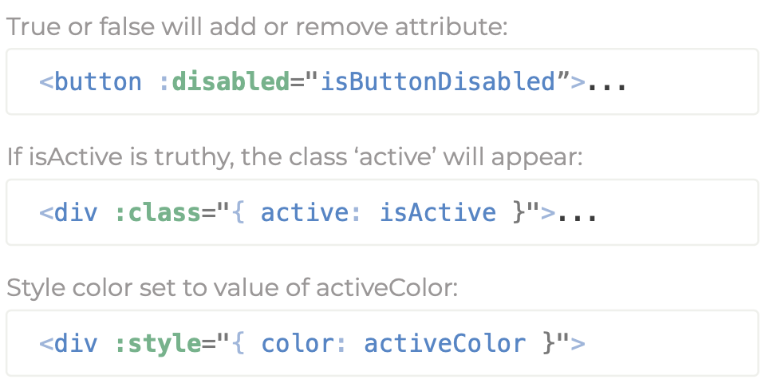
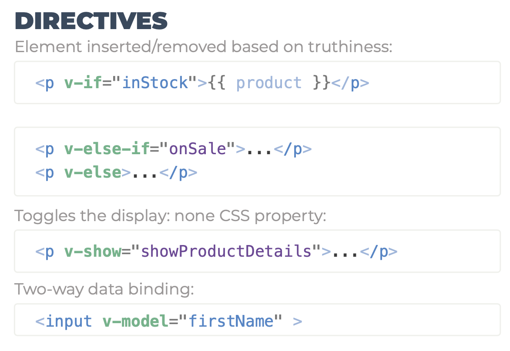
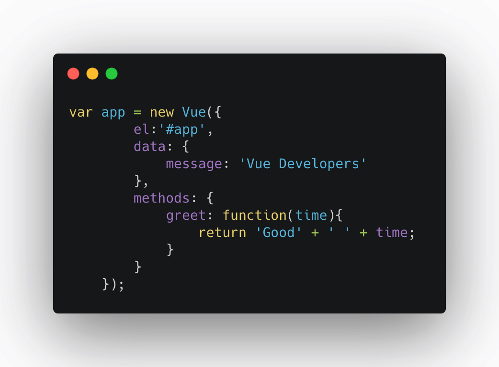
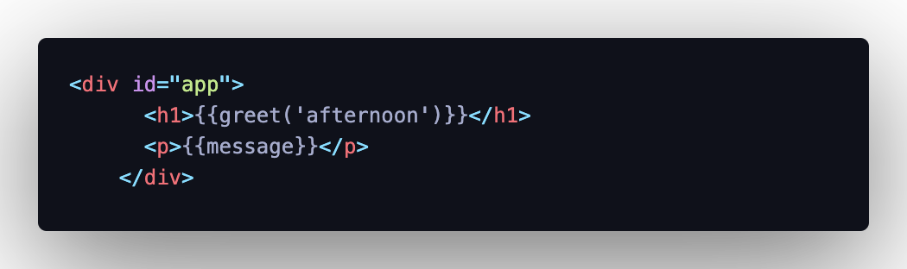

# Vue Basics

### Declarative Rendering and Attributes

As we have seen so far one of the main features of Vue is the way it renders the data in our view. In a fast and efficient way, using the Virtual DOM.
To update and refresh the data that is hosted in the logic layer and that allows changes to be made in the view Vue uses what is called declarative rendering. That is, declarative rendering is what allows the system to become reactive and Vue to effectively load and refresh the Virtual DOM.

When we refer to Vue's reactivity, we are talking about the system's capacity to show the appropriate modifications in the view when we make changes in the logical part. This means that if we modify any of our properties hosted in **data** the system will automatically modify all the parts where the value of that property is being shown or rendered.

```
app.message = 'Hello class';
```

Within the app variable, which represents our application in Vue, everything we have defined within the **data** object is treated as local variables at our instance of Vue. We can refer to those variables with the dot or square-bracket notation.

As we have observed when defining the **_message_** property, through the template syntax we can handle the variables of our Vue instance. The problem is that this would only serve to interpolate variables or show primitive variables, since within the notation {{}} we will only be able to host a **_expression_**.

```
<div id="app">{{ message1 + message2  }}</div>
<div id="app">{{ message.split('').reverse().join('') }}</div>
```

That's why Vue puts at our service another way of rendering and working with the variables that we have defined in the **data** object of our Vue app. This is called **directives**.

Vue directives can be understood as Vue functionality to handle our data in a more efficient way. We could understand Vue directives as a kind of predefined functions. Directives are special attributes with the `v-` prefix.

Declarative attributes are litle bit diferent than rendering. Trying to binding between an html attribute and our property defined in the data object needs a specific directive.

```
<!-- It doesn't work-->
<div id="app" title="{{message}}">{{ message }}</div>
```

Vue makes available to us a specific directive: `v-bind`

```
<div id="app" v-bind:title="message">{{ message }}</div>
```

A few examples of use:



`v-bind` is used to reactively update an html attribute. In the example we have used we could interpret the binding as something similar to keep the title attribute of this element (div) updated with the message property.

In one of the previous examples:

`<button v-bind:disabled="isButtonDisabled">Button</button>`

Only when the property isButtonDisable is true will create a binding with the disable property of the button. In any other case the disabled property will not be included in the html element.

There are many directives for handling the DOM:


### Data & Methods

As we have observed, Vue's directives allow us to manage the data and the view of our application through simple functions/shorcuts. Apart from making a binding of these directives to properties of our **data** object we can also use another way to handle the data of our application and then render it in the DOM. This alternative is the use of computed properties and the use of methods, the result of both can be linked to a directive which is even more powerful.

In such a way that the object **OPTIONS** passed to the instance of Vue until the moment would be in the following way:

    └─ el
    ├─ data: {}
    ├─ computed: {}
    └─  methods: {}

Therefore, we pass to the Vue instance in both cases (methods or computed properties), an object that contains the list of methods of our application or the list of computed properties of our application.

The methods we define are exactly the same as the JavaScript functions, which means that those methods can make side-effects or return a value. In the second case, the result can be interpolated into the DOM if we wish:



As we observe we can invoke the methods with parameters or without them and return values to interpolate them later with the template syntax.



Likewise, the methods and computed properties that we create can access the properties that we have defined within the **data** object:

```
greet: function (time) {
          return "Good" + " " + time + " " + this.message;
        }
```

