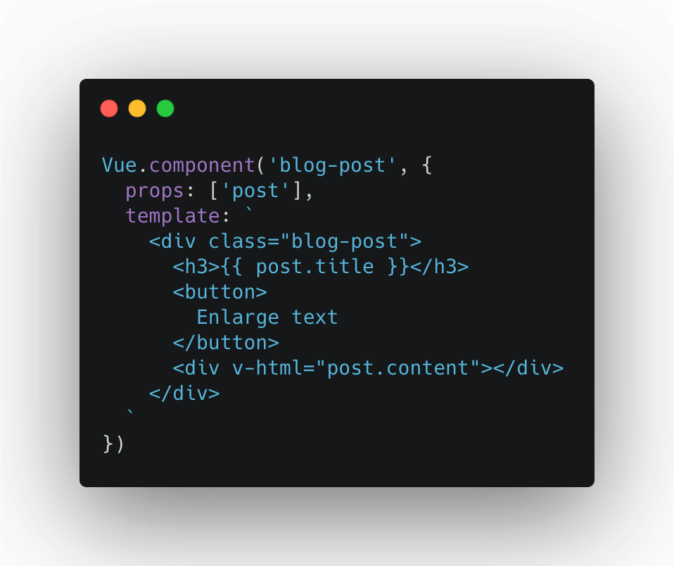
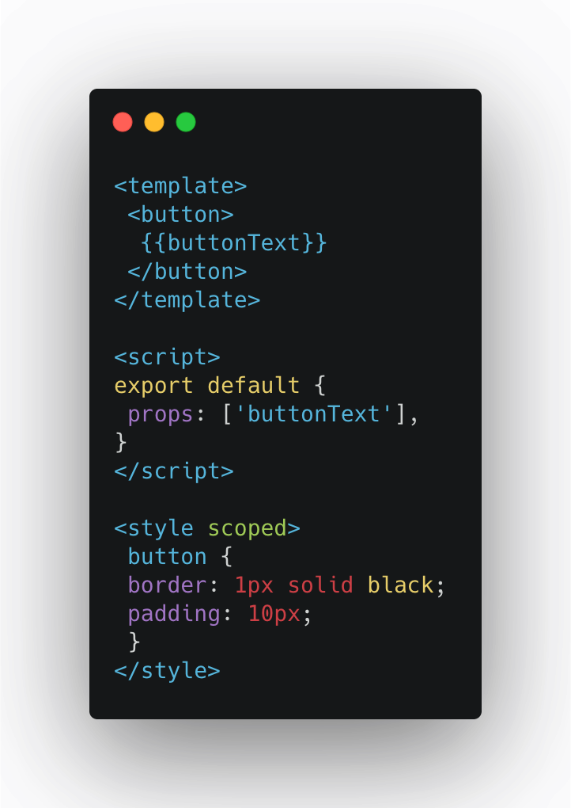
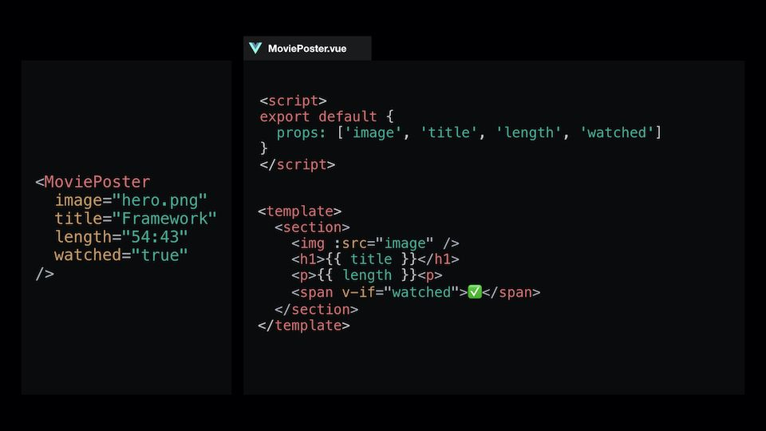

# What is a component of Vue?

### Introduction to Vue Components

The component-driven architecture is currently a dominant feature. The idea of component is based on the ability to create reusable pieces to encapsulate core functionality into singular blocks, reducing overall complexity, allowing for better separation of concerns, collaboration, and scalability.

Generally when we conceive the design of a new component we should consider the following aspects:

- Make an initial functional design in which we determine what properties our component needs to receive and what local data we need to define to give the functionality we want to our component.

- If the component is a visual component (ie, has styles) we need a way to stop the styles leaking out into the rest of our application

- Register this component so that it can be used globally throughout the application

- Register this component so that it can be used locally within a component

**Registering components globally**

We can create components and register them globally with the following interface:
```
 Vue.component(name: string, options: Object<VueInstance>)
```
Although it isn't required, when naming our components it's important to adhere to the naming conventions set by the W3C Custom Elements specification (https://www.w3.org/TR/custom-elements/#valid-custom-element-name), that is, all-lowercase and it must contain a hyphen.
inside of our App.vue file, let's register our FancyButton component by first importing it from the appropriate path:

```
import HelloWorld from "./components/HelloWorld.vue";
```
Afterwards, we can register the component (by two different ways)



```
Vue.component('fancy-button', FancyButton);
```


Our component has now been registered globally. Now we use this inside of our App.vue component, with the tag that we specified. We just add that to the template like so:

```
<template>
 <fancy-button/>
</template>
```
**Registering a component locally**

We can also register our components locally within our application. This can be done by adding it specifically to our Vue instance

```
Vue.component('fancy-button', FancyButton);
```
Before adding any code into our app component, notice that our button has disappeared now that we're no longer globally registering it. To register this locally, we'll need to first import the component similar to how we did before and then add this to a component object within the instance:

```
<template>
 <div>
 <fancy-button></fancy-button>
 <button>I'm another button!</button>
 </div>
</template>

<script>
import FancyButton from './components/FancyButton.vue';

export default {
 components: {
 FancyButton
 }
}
</script>

<style>

</style>
```


### PROPS

We've now got the ability to create reusable components that allow us to encapsulate functionality within our project. In order to make these components usable, we'll need to give them the ability to communicate with oneanother. The first thing we'll be looking at is one way communication with component properties (referred to as "props").

The point of component communication is to keep our features distributed, loosely coupled, and in turn make our application easier to scale. To enforce loose coupling, you should not attempt to reference parent component(s) data within the child component and it should be passed using props only.

***When it comes to passing information down from one component to another, props are the first technique that most Vue developers encounter. By defining a props property on a component, it can then receive data.***



Notice how we're able to bind to the buttonText value inside of our template as we've created ourselves a props array that contains string or object values for each component property. Setting this can be done with kebab case as an attribute on the component itself, this is required as HTML is case-insensitive:

```
<template>
 <fancy-button button-text="I'm set using props!"></fancy-button>
</template>
```


### Defining Props: Best Practices


**The Object Syntax**
Instead, for most scenarios, we should define our props using the Object syntax. This allows us to define three key prop attributes that allow you to answer three fundamental questions:

```type```: What data type(s) can be expected?
```required```: Is the prop is required or not
```default```: Is there default content that accounts for most scenarios so we don’t have to repeat ourselves multiple time?

Finally, when defining your props, remember to answer the three fundamental questions:

- What data type(s) can be expected?
- Is the prop required?
- Can you provide default data to account for most scenario?
Remember that props are useful for providing detailed specifications on how to use a component, but this is also it’s downside as this does not allow flexibility on the developer’s part.

### Scoped styles

The scoped attribute isn't part of Vue by default, this comes from our Webpack vue-loader. 
Component Scoped CSS, SCSS so that is only available inside the component: and that bring to us a way to avoid class collisions.
When using scoped CSS within Vue, keep in mind that rules created within the component won't be accessible globally across the application: