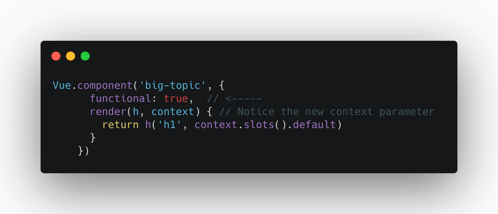
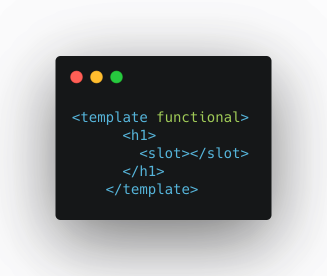

### Instance Lifecycle Hooks

When we initialize our instance of Vue, a series of methods associated with the life cycle of our application are triggered. At the same time there is what is known as Lifecycle Hooks, to be able to alter the way in which the call to the methods mentioned above are triggered and thus be able to add our code at specific times.

The life cycle of Vue begins when we declare the new instance of Vue by calling its constructor `new Vue()` after that, Vue proceeds to examine the events and lifecycle hooks that we may have overwritten.
At this point, it is important to specify that **the data object does not exist** from our instance of Vue.

After being executed the **_beforeCreate_** method, Vue has access to the data object of our app. The Vue instance has already been created.

### A Functional Component:
- Can’t have its own data, computed properties, watchers, lifecycle events, or methods.
- Can’t have a template, unless that template is precompiled from a single-file component. That’s why we used a render function above.
- Can be passed things, like props, attributes, events, and slots.
Returns a VNode or an array of VNodes from a render function. Unlike a normal component that has to have a single root VNode, it can return an array of VNodes.

As you might imagine (without less functionality) a functional component is a little faster. We can make a functional component by simply adding the option:

Notice how we now use the context parameter to access slots? This context argument is how we get access to to things like props, children, data, parent, listeners, and slots inside a functional component since we no longer can use this. The official Vue documentation goes into more detail.

If we’re using Vue’s single file components we can declare a functional components at the template level. Here is the above example as a single file component:

